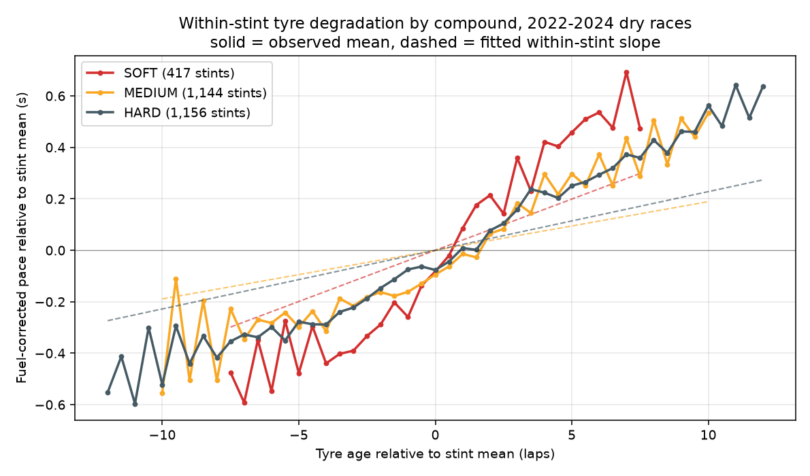

# Formula 1 Race Strategy Modeling

Tyre-degradation curves and pit-stop models built from Formula 1 timing, telemetry and
weather data ([FastF1](https://docs.fastf1.dev/)), 2022-2024.

Full write-up: [PAPER.md](PAPER.md)

## Results

- **Degradation.** SOFT tyres lose **0.040 s per lap of age** (95% CI 0.022 to 0.057),
  about twice MEDIUM (0.019) and HARD (0.023). MEDIUM and HARD are not statistically
  different (p = 0.34), so no ordering between them is claimed.
- **Pit window.** A gradient-boosting classifier predicting whether a driver pits in the
  next 3 laps scores **0.81 ROC-AUC on the held-out 2024 season**, against 0.59 for
  ranking laps by tyre age alone.
- **Finishing position.** A regressor for final position does **not** beat the simple
  baseline of predicting the grid position (MAE 2.76 vs 2.72 on 2024).



## Data

| | |
| --- | --- |
| Seasons | 2022-2024 (ground-effect era) |
| Races ingested | 68 (58 dry races modelled) |
| Driver-laps ingested | 74,603 |
| Driver-laps after cleaning | 53,708 (72.0%) |
| Stints used for degradation | 2,717 |
| Drivers / circuits | 28 / 25 |

Lap timing, per-sample car telemetry (aggregated to one row per lap) and trackside
weather (nearest reading to the lap start) are joined into one driver-lap table.

**Why only 2022 onward.** 2022 moved F1 from 13-inch to 18-inch wheels with new tyre
constructions, so degradation before and after is a different process. Pooling older
seasons would add rows but mix two regimes.

**Cleaning.** In-laps, out-laps, safety car / VSC / red-flag laps, wet races,
non-slick compounds and laps outside 0.9-1.2x the session median are removed:

| Filter | Laps left | Dropped |
| --- | --- | --- |
| Raw driver-laps | 74,603 | |
| Has a lap time | 72,690 | 1,913 |
| Drop in-laps | 70,322 | 2,368 |
| Drop out-laps | 68,170 | 2,152 |
| Drop SC / VSC / red-flag laps | 64,904 | 3,266 |
| FastF1 `IsAccurate` | 64,479 | 425 |
| Dry compounds only | 60,366 | 4,113 |
| Drop races with rainfall | 53,832 | 6,534 |
| Has tyre age | 53,755 | 77 |
| Within 0.9-1.2x session median | 53,708 | 47 |

## Method

**Corrections.** Two effects make laps faster over a race regardless of the tyre, and
both would bias degradation toward zero if left in:

- *Fuel:* `lap_time - fuel_remaining_kg * 0.03`, with 100 kg at the start burned
  linearly. Both constants are standard rules of thumb, not fitted (see Limitations).
- *Track evolution:* the field's median lap time per lap number within each race,
  smoothed with a 5-lap rolling median, used as a regressor.

**Degradation model.** Fuel-corrected lap time on tyre age by compound, with a fixed
effect for every stint and standard errors clustered by race.

The stint fixed effects matter. A pooled model with circuit and driver effects looks
fine, but the track-evolution coefficient, which should be close to -1 by construction,
came out at **+0.40**. Stint length is a strategic choice (HARD stints average 27 laps,
SOFT 16), so the pooled slope was partly picking up differences between stints. With
stint effects the coefficient is **-1.02**. Both models are in `src/degradation.py`.

| Compound | s/lap | 95% CI | Laps |
| --- | --- | --- | --- |
| SOFT | 0.0398 | 0.0222 to 0.0574 | 5,661 |
| MEDIUM | 0.0189 | 0.0099 to 0.0280 | 19,606 |
| HARD | 0.0228 | 0.0161 to 0.0295 | 28,123 |

SOFT is the fastest-degrading compound under every tyre-age cutoff tested (15, 20, 25,
30 laps and none). A quadratic term comes out *negative* for MEDIUM and HARD, which is
selection rather than physics: teams pit when a tyre falls off, so post-"cliff" laps are
mostly missing from the data.

**Pit-window classifier.** `HistGradientBoostingClassifier`, one row per lap. Features
are things the pit wall knows at lap L: tyre age and compound, pace vs the field, a
3-lap pace trend, position, laps remaining, stops so far, track temperature, circuit
and team. Total stint length is excluded since it is what is being predicted.

| Split | Laps | Base rate | ROC-AUC | PR-AUC | Precision | Recall |
| --- | --- | --- | --- | --- | --- | --- |
| Validation (2023) | 18,066 | 10.2% | 0.800 | 0.346 | 0.312 | 0.556 |
| Test (2024) | 19,530 | 8.8% | 0.810 | 0.303 | 0.240 | 0.685 |

Only 8.8% of laps are positive, so accuracy is not reported (always predicting "no
stop" would score 91%). PR-AUC is about 3.4x the base rate.

**Finishing-position regressor.** Predicts `final_position - grid_position` and adds
the grid back. Two variants:

| Model | Test MAE | Grid baseline MAE | R² |
| --- | --- | --- | --- |
| Post-race summary (stops, pace, compounds used) | 2.756 | 2.718 | 0.52 |
| Pre-race only (grid, team, circuit) | 3.171 | 2.718 | 0.45 |

Neither beats the grid baseline on 2024. The post-race model did beat it on 2023 (2.37
vs 3.52), but 2024 was a more predictable season (baseline 2.72 vs 3.52), and with about
400 training rows the model did not carry over. Hyperparameters were chosen on 2023
before 2024 was scored; see [docs/model_selection.md](docs/model_selection.md).

## Validation and leakage

Splits are by season: train 2022, validate 2023, test 2024. The test model is refit on
2022-2023 and the decision threshold is taken from validation. An expanding-window run
(train on seasons up to Y, test on Y+1) gives ROC-AUC 0.806 and 0.805.

`src/leakage_check.py` checks the pipeline in code: it parses the source for any random
split or shuffling, confirms the fitted imputer learned the training-fold median,
checks weather is joined at lap start, and checks the label is forward-looking.
Result: 8 pass, 1 flagged for manual review.

Known caveats:

- The field-baseline pace uses a centred 5-lap window, so lap L's baseline sees laps
  L+1 and L+2 of the same race. It is a field-wide number, not driver-specific, but it
  is not strictly past-only. A trailing window would fix it.
- The post-race finishing model's `deg_exposure` feature uses degradation slopes fitted
  on all three seasons. It is three pooled constants, and the model does not beat its
  baseline anyway, but a stricter version would fit the slopes on training seasons only.

## Limitations

- Fuel constants are assumed, not fitted, and their sensitivity is untested. A larger
  s/kg would steepen all three slopes by a similar amount, so the gaps between
  compounds are more robust than the absolute values.
- Wet races are excluded, so nothing here applies to wet strategy.
- No gap or traffic features, which is the biggest missing input for pit timing (the
  undercut depends on it).
- Slopes are pooled across drivers and circuits. Pirelli brings different compounds to
  each circuit, so "HARD" is not one physical tyre across races.
- Three seasons means one season each to train, validate and test.

Next steps: gap-to-car-ahead features, fitting the fuel coefficient per circuit, a
separate wet-weather model, and modelling stint length as a survival problem.

## Running it

```bash
python -m venv .venv && source .venv/bin/activate
pip install -r requirements.txt
./run_all.sh          # ingest, features, degradation, models, leakage checks
streamlit run app.py  # explorer over the saved results
```

The FastF1 API allows 500 requests per hour and a race costs about 20 on first
download, so the first ingest spans several hours. `src/ingest_resumable.py` waits out
the limit and skips races already downloaded. Everything after ingest runs in seconds.

```
src/config.py            paths, season splits, modelling constants
src/ingest.py            FastF1 -> one parquet per race (timing + telemetry + weather)
src/ingest_resumable.py  rate-limit-aware wrapper around ingest.py
src/features.py          cleaning, fuel and track-evolution corrections, labels
src/degradation.py       degradation models, contrasts, window sensitivity, figure
src/models.py            pit-window classifier and finishing-position regressor
src/leakage_check.py     leakage checklist
src/report.py            prints every number quoted above from the saved outputs
app.py                   Streamlit app
```

`cache/` (FastF1 downloads, several GB), `data/` and `models/` are regenerated by
`run_all.sh` and not committed.
